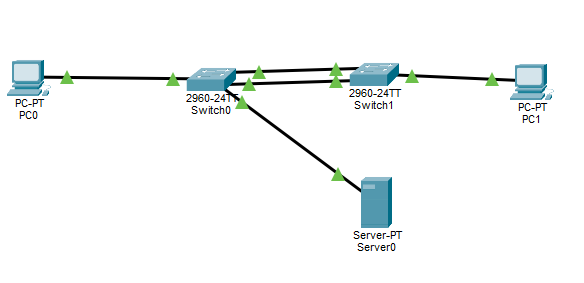
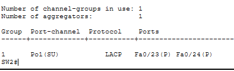
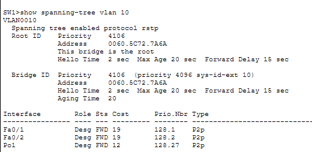
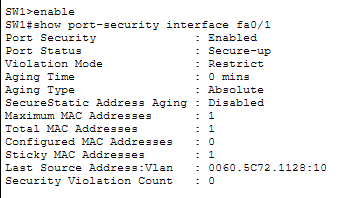
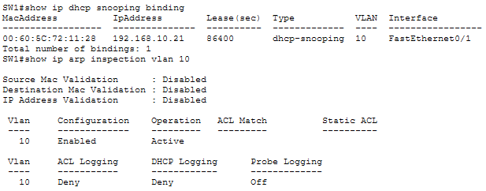
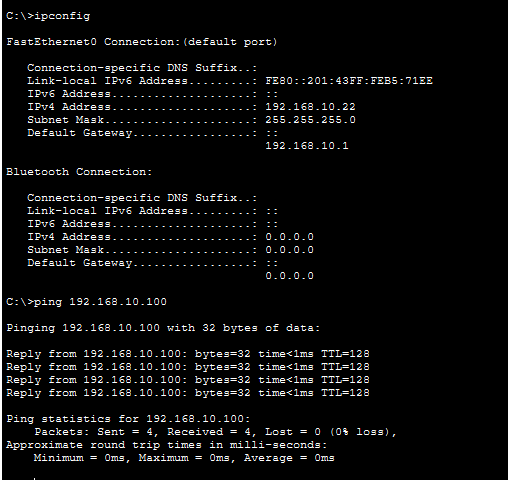

# Cisco L2 Security & Redundancy Lab


A hands-on **Cisco Packet Tracer networking project** focused on Layer 2 security, redundancy, and reliable network connectivity. The lab implements VLAN segmentation, LACP EtherChannel, Rapid PVST+, Port Security, BPDU Guard, DHCP Snooping, and Dynamic ARP Inspection (DAI), with configuration validated through Cisco IOS CLI verification.

## Project Highlights

- Designed a redundant Layer 2 topology using **LACP EtherChannel**
- Configured **Rapid PVST+** and established the STP root bridge
- Implemented **Port Security with sticky MAC addresses**
- Enabled **PortFast and BPDU Guard** on end-device ports
- Configured and tested **DHCP**
- Implemented and verified **DHCP Snooping and Dynamic ARP Inspection (DAI)**
- Performed connectivity and configuration verification using **Cisco IOS CLI**
- Troubleshot Layer 2 security and DHCP behavior in Cisco Packet Tracer

## Topology

Two Cisco switches are connected through a two-link LACP EtherChannel. End devices and a DHCP server operate on VLAN 10.



## Technologies & Skills

**Networking:** VLANs • 802.1Q Trunking • LACP EtherChannel • STP • Rapid PVST+ • Layer 2 Redundancy

**Network Security:** Port Security • Sticky MAC • BPDU Guard • DHCP Snooping • Dynamic ARP Inspection

**Services & Troubleshooting:** DHCP • Cisco IOS CLI • Connectivity Testing • Network Verification • Layer 2 Troubleshooting

## Key Implementations

### VLAN & Trunking

- VLAN 10 — `USERS`
- End-device access ports assigned to VLAN 10
- Trunking configured between switches
- VLAN connectivity verified through end-to-end testing

### LACP EtherChannel

Two physical links between the switches are bundled into `Port-channel1` using LACP.



Verified with:

```text
show etherchannel summary
```

Expected operational state:

```text
Po1(SU)   LACP   Fa0/23(P) Fa0/24(P)
```

### Rapid PVST+

Rapid PVST+ provides loop prevention and Layer 2 redundancy. Switch0 is configured as the STP root bridge for VLAN 10 with a priority of 4096.



Verified using:

```text
show spanning-tree vlan 10
```

### Port Security

User-facing access ports use:

- Maximum 1 secure MAC address
- Sticky MAC learning
- Violation mode: `restrict`
- PortFast
- BPDU Guard



### DHCP Snooping & Dynamic ARP Inspection

DHCP Snooping and DAI were configured and verified on the primary switch for VLAN 10. The DHCP Snooping binding table records a dynamically learned client address, while DAI is confirmed enabled and active for VLAN 10.



**Packet Tracer implementation note:** DHCP Snooping on the second switch caused PC1 DHCP allocation to fail in this specific topology despite the EtherChannel and physical uplinks being correctly configured and trusted. To maintain a fully functional lab, DHCP Snooping and DAI were retained on the switch where they could be successfully verified, while the second switch uses the other Layer 2 security controls.

### DHCP & Connectivity Verification

PC1 successfully obtained a DHCP address and communicated with the server.



Example verification:

```text
PC1 IPv4 Address: 192.168.10.22
Ping to Server: 0% packet loss
```

## Verification Summary

| Capability | Result |
|---|---|
| VLAN 10 | Verified |
| 802.1Q Trunking | Verified |
| LACP EtherChannel | Verified |
| Rapid PVST+ | Verified |
| STP Root Bridge | Verified |
| Port Security | Verified |
| Sticky MAC | Verified |
| PortFast | Verified |
| BPDU Guard | Verified |
| DHCP | Verified |
| DHCP Snooping | Verified on Switch0 |
| Dynamic ARP Inspection | Verified on Switch0 |
| End-to-End Connectivity | Verified |

## Project Files

- `Cisco_L2_Security_Redundancy_Lab.pkt` — Cisco Packet Tracer project
- PNG screenshots — configuration and verification evidence

## Tools

- Cisco Packet Tracer
- Cisco IOS CLI
